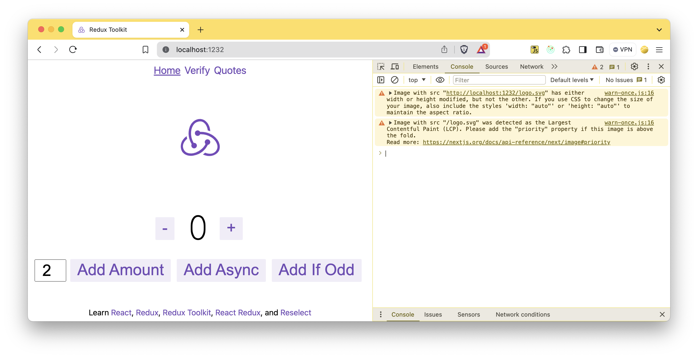
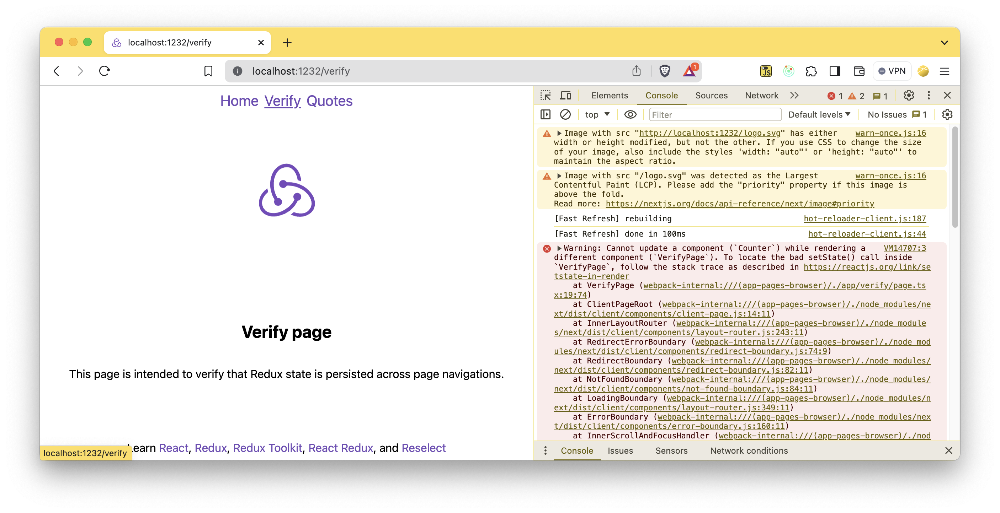

## Adding code from instructions on redux site to next js example causes error

Starting from the minimal with-redux example fron next.js github repo

https://github.com/vercel/next.js/tree/canary/examples/with-redux

Then adding code as advised on the redux web page

https://redux.js.org/usage/nextjs#per-route-state

Causes the error when navigating from Home to Verify page





```
VM13857:3 Warning: Cannot update a component (`Counter`) while rendering a different component (`VerifyPage`). To locate the bad setState() call inside `VerifyPage`, follow the stack trace as described in https://reactjs.org/link/setstate-in-render
```
